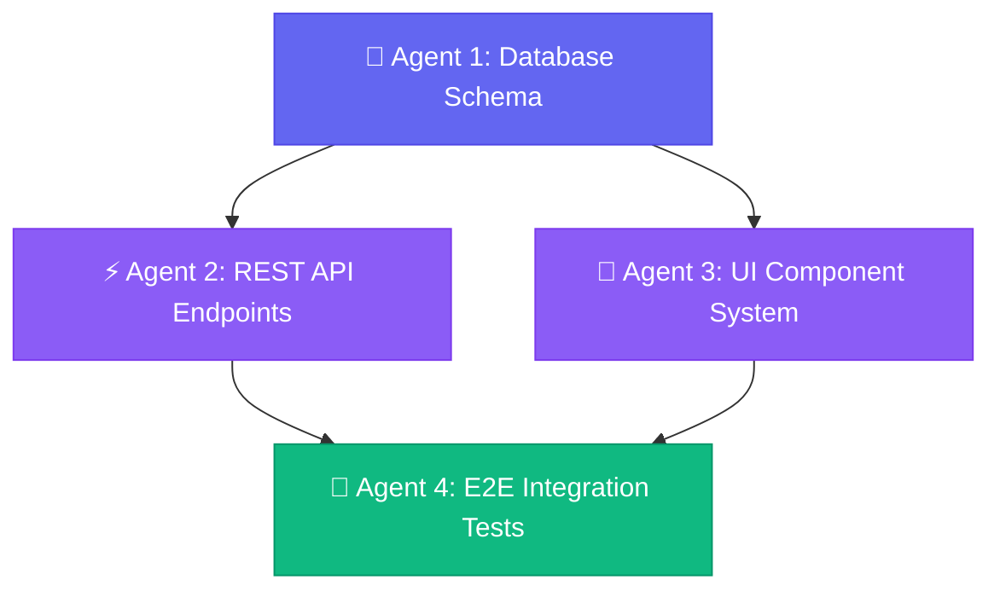

<div align="center">

<br/>

<div align="center">

<br/>


# HYPERION

### **The Command Center for Parallel AI Coding Agents**

*Stop juggling 47 browser tabs & terminal windows. Welcome to agentic developer bliss.*

<br/>

[](LICENSE)
[](https://github.com/Hyperion-Workspace/Hyperion/stargazers)
[](https://github.com/Hyperion-Workspace/Hyperion/actions)
[](https://tauri.app)
[](https://nextjs.org)

<br/>

[🌐 Website](https://hyperions.bond) &nbsp;•&nbsp; [📚 Documentation](https://hyperions.bond/en/docs) &nbsp;•&nbsp; [🚀 Quick Start](#-quick-start) &nbsp;•&nbsp; [🐛 Report Bug](https://github.com/Hyperion-Workspace/Hyperion/issues) &nbsp;•&nbsp; [💬 Community](https://github.com/Hyperion-Workspace/Hyperion/discussions)

<br/>


</div>

<br/>

---

## 🤯 The Daily Developer Chaos

We’ve all been there: 

```
  ┌─────────────────────────────────────────────────────────────────────────────┐
  │  Terminal #1 ──► Browser Tab #19 ──► Notes App (Where was that prompt? 🤔)  │
  │        ▲                                               │                    │
  │        └────── 💥 Agent Crashed ◄── Copy/Paste ────────┘                    │
  └─────────────────────────────────────────────────────────────────────────────┘
                          😵 ALTO-TAB FATIGUE & LOST CONTEXT
```

**Hyperion is your context rescue protocol.** It unifies hardware-accelerated PTY terminal grids, real-time Kanban task dispatching, versioned prompt forge, and multi-agent DAG swarms into **one gorgeous, high-performance native space bar.** 🎨✨

<br/>

## 🎯 Why Developers Fall in Love

<table>
<tr>
<th width="50%" align="left">🚫 Life Before Hyperion</th>
<th width="50%" align="left">🚀 Life With Hyperion</th>
</tr>
<tr>
<td>

- 😵‍💫 Lost in 12 background terminal windows
- 📝 Searching old chat logs for that *one working prompt*
- 🙈 Zero visibility into what 3 agents are doing simultaneously
- 🧠 Brain friction switching between projects & tools
- 🐢 Single-agent bottlenecking

</td>
<td>

- 🎯 **Scoped Terminal Grid:** Perfect project boundaries
- 🧪 **Prompt Forge:** Version control for your prompts (v1.0 ➔ v1.2)
- 📊 **Kanban Dispatch:** Drag tasks directly onto agents & watch magic happen
- 🛡️ **Zero Context Bleed:** Isolated SQLite & PTY states
- 🐝 **Agent Swarms:** Parallel DAG dependency orchestration

</td>
</tr>
</table>

<br/>

## ⚡ Quick Start (Under 60s)

Get up and running natively in seconds! 🏃‍♂️💨

```bash
# 1. Clone the magic repository 🧙‍♂️
git clone https://github.com/Hyperion-Workspace/Hyperion.git

# 2. Jump into the workspace
cd Hyperion

# 3. Install packages (pnpm v10+ corepack recommended)
pnpm install

# 4. Launch Desktop Client 🚀
pnpm tauri dev
```

> **Prerequisites:** Node.js `>=20`, pnpm `>=10`, and [Rust Toolchain](https://www.rust-lang.org/tools/install).

<details>
<summary><b>🍿 Interactive Tour & Pro Tips (Click to expand)</b></summary>
<br/>

1. **`+ Create Workspace`**: Click in the sidebar. Each workspace is a pristine sandbox isolated from the rest of your system.
2. **Split Terminal Panes**: Spawn terminal split-grids that automatically inherit your current workspace root folder.
3. **Drag-and-Drop Dispatch**: Drop a task card on your Kanban board and pull an AI Agent to start working immediately.
4. **Live Token Streams**: Watch terminal outputs, file creations, and diff updates flow live inside hardware-accelerated Xterm panes.

</details>

<br/>

---

## 🔮 Core Magic & Architecture

```
                 ┌──────────────────────────────────────────────┐
                 │                HYPERION SHELL                │
                 │         Tauri 2 · Desktop & Mobile Shell     │
                 └──────────────────────┬───────────────────────┘
                                        │
              ┌─────────────────────────┴─────────────────────────┐
              ▼                                                   ▼
┌───────────────────────────────┐                 ┌───────────────────────────────┐
│       WORKSPACE ENGINE        │                 │       ORCHESTRATION HUB       │
├───────────────────────────────┤                 ├───────────────────────────────┤
│  • Scoped Project Sandboxes   │                 │  • Swarm DAG Dependency Engine│
│  • Hardware PTY Terminal Pool │ ◄─────────────► │  • Task Dispatch Kanban Board │
│  • SQLite Local State Store   │                 │  • Versioned Prompt Forge     │
└───────────────────────────────┘                 └───────────────────────────────┘
```

<br/>

### 🐝 Interactive Workflow Examples

> *Don't wait on one agent. Wire multiple agents in a dependency graph or dispatch via Kanban cards! Click Next below to toggle views.*

<div align="center">

<details open>
<summary><b>Example 1: Multi-Agent Swarm DAG (Click to collapse / view next example below)</b></summary>

<br/>



</details>

<details>
<summary><b>Example 2: Live Kanban Agent Dispatch (Click to open Next Example) ➔</b></summary>

<br/>

```
┌─────────────────────────┬─────────────────────────┬─────────────────────────┐
│ 📌 BACKLOG              │ ⚡ DOING (IN SWARM)      │ ✅ COMPLETED            │
├─────────────────────────┼─────────────────────────┼─────────────────────────┤
│ • Add Stripe Webhook    │ 🤖 Agent Alpha: Auth    │ • Setup Tauri v2 Shell  │
│ • Write E2E Tests       │ 🤖 Agent Beta: API      │ • Next.js App Routing   │
│ • Prompt Forge v1.2     │ 🤖 Agent Gamma: UI      │ • Scoped PTY Grid       │
└─────────────────────────┴─────────────────────────┴─────────────────────────┘
```

</details>

</div>

<br/>

---

## 🛠️ The Tech Under The Hood

| Subsystem | Tech Powering It | Why We Chose It |
| :--- | :--- | :--- |
| **Native Shell** | `Tauri 2` + `Rust` | Ultra-lightweight memory footprint & blazing speed |
| **Frontend Framework** | `Next.js 16` (App Router) | Static export webview runtime (`output: "export"`) |
| **Design System** | `Tailwind v4` + `shadcn/ui` | Gorgeous OKLCh color palettes & slick animations |
| **State Engine** | `Zustand` | Ultra-fast client-side reactive state |
| **Terminal Core** | `xterm.js` + `node-pty` | Hardware-accelerated GPU terminal rendering |
| **Persistence** | `SQLite` | High-throughput offline-first local storage |

<br/>

---

## 🗺️ Visual Feature Roadmap

```
Phase 1: Foundations & UI Core         [████████████████████] 100% Shipped! 🎉
Phase 2: Terminal PTY Grid & Scoping   [████████████████████] 100% Shipped! ⚡
Phase 3: Real-Time Agent Streamer      [██████████████░░░░░░]  70% In Progress 🔨
Phase 4: Swarm DAG Orchestrator        [████████░░░░░░░░░░░░]  40% In Progress 🐝
Phase 5: Plugin Ecosystem & Cloud Sync [░░░░░░░░░░░░░░░░░░░░]   0% Up Next 🔮
```

<br/>

---

## 🤝 Join the Swarm (Contributing)

Contributions are what make the open-source community such an amazing place! 💖

```bash
# Create your feature branch
git checkout -b feat/ultra-playful-feature

# Run Quality Gates before opening PR
pnpm check && pnpm typecheck && pnpm build

# Commit using Conventional Commits
git commit -m "feat: add supercharged prompt playground"
```

Check out our [Contributing Guide](CONTRIBUTING.md) and [Docs](https://hyperions.bond/en/docs) for deep technical details.

<br/>

---

<div align="center">

## 📄 License & Attribution

Distributed under the **MIT License**. Crafted with ❤️ by **[Hyperion-Workspace](https://github.com/Hyperion-Workspace)** and our stellar open-source community.

<br/>

**⭐ Give Hyperion a star if it saved you a browser tab or boosted your workflow!**

</div>

